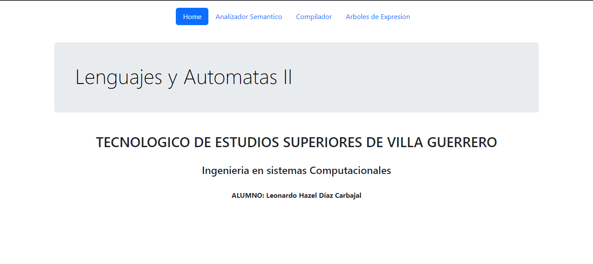

# Lenguajes y Automatas II

Sitio web desarrollado para demostrar los conocimientos adquiridos durante el curso referente a la materia de Leunguajes y Automatas II. Dicho sitio web fue desarrollado principalmente con HTML y el Framework de Bootstrap.

## Preview

## Developer

- [@Leonardo Diaz](https://github.com/LeonardoDiaz1)

## License 

[Derechos Reservados &copy; Leonardo Diaz - 2023]()